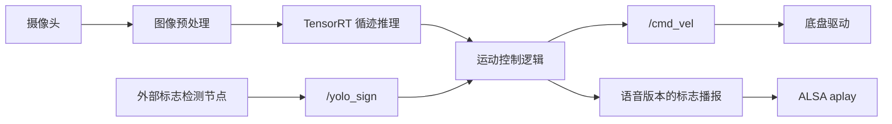
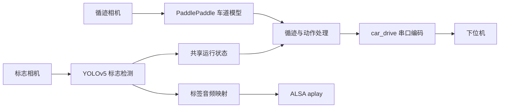

# 代码结构说明

## ROS 和 TensorRT 路线

`car_line.py` 为基础循迹入口；`car_auto.py` 在该控制路线中加入交通标志响应；`car_auto_test.py` 进一步导入 `traffic_sign_audio.py`，用于标志语音播报。

`CameraCapture` 维护最新摄像头帧，`AsyncPublisher` 通过队列异步发布运动指令。`MotionController` 接收标志消息，管理标志队列和运行状态。语音模块维护类别到音频的映射，以及相同标志的播报间隔。

ROS 路线的标志检测节点、底盘驱动及消息包位于外部工程，不在当前目录中。

## PaddlePaddle 和 YOLOv5 路线

`SY4Y.py` 通过循迹与标志识别进程共享运行状态，调用串口协议函数控制底盘，并根据识别标签播放音频。

车道模型由 `model_paths` 定义；标志检测调用 YOLOv5 工程中的模型加载和后处理函数。`hex_change.car_drive` 负责生成底盘指令，其实现需从原项目补齐。

两条路线分别保留各自的设备路径、模型约定和控制参数。具体配置见 [运行配置说明](SETUP.md)。
